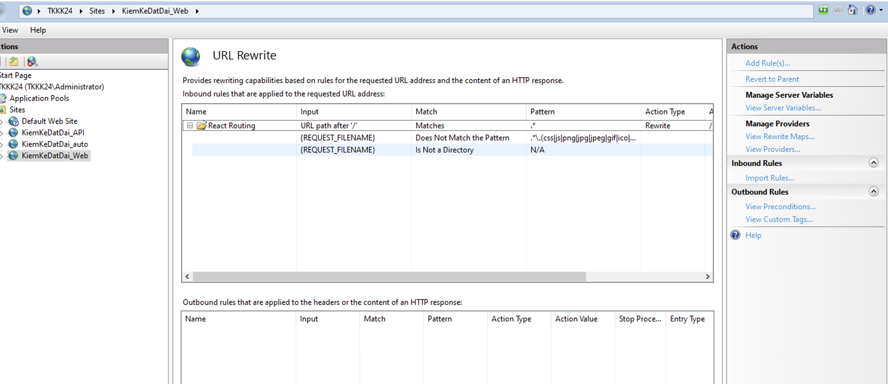
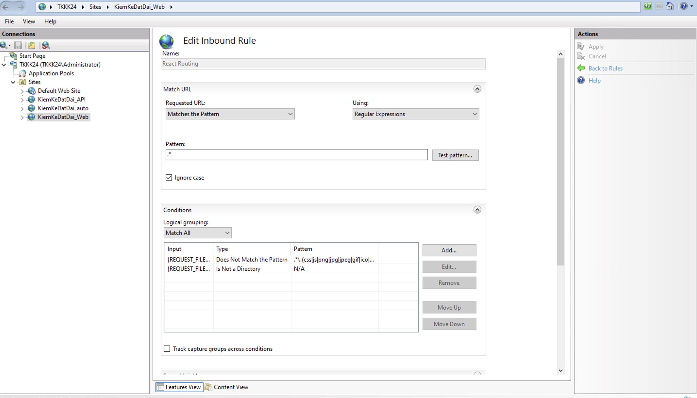

TRANG THAI CUA BAO CAO:

TrangThaiDuyet = 0 (chưa gửi) k hiển thị gì
TrangThaiDuyet  = 1(chờ duyệt) hiển thị 2 button "Duyệt" "Trả lại"
TrangThaiDuyet  = 2(đã duyệt) hiển thị 2 button "Duyệt" "Trả lại" nhưng button "Duyệt" disabled

export const CAP_DVHC_ENUM = {
    TRUNG_UONG: '0',
    VUNG: '1',
    TINH: '2',
    HUYEN: '3',
    XA: '4',
}

admin/Letinh$202512368

Xử lý lỗi refresh trang 404 - ISS:

URL REWRITE

